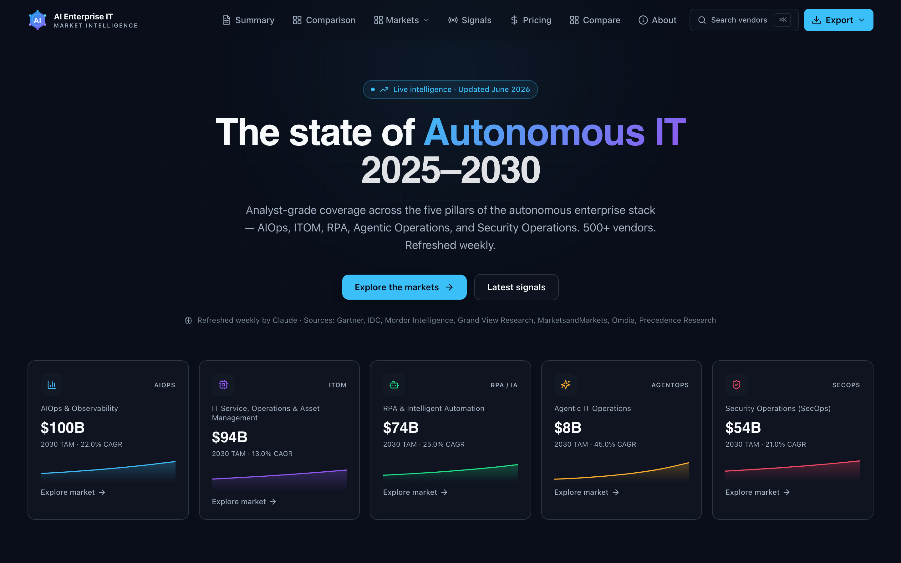
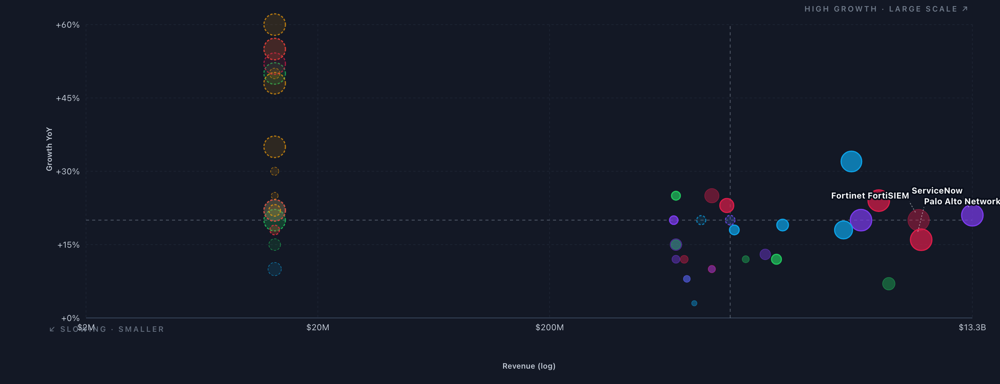

# Autonomous IT Market Intelligence

**Analyst-grade, continuously-refreshed market intelligence for the autonomous enterprise IT stack** — five markets, 500+ profiled vendors, statically prerendered for SEO and shipped as a WordPress plugin.

[](https://aienterpriseit.com/market-intelligence/)


-8b5cf6)


🔗 **Live:** [aienterpriseit.com/market-intelligence](https://aienterpriseit.com/market-intelligence/)



---

## What this is

An interactive market-intelligence portal covering the five pillars of the autonomous enterprise IT stack. Each market ships TAM/CAGR sizing, sortable vendor tables, a cross-market positioning chart, and per-vendor deep-dive profiles (SWOT, sentiment, ICP, future focus). The dataset is refreshed weekly by an automated Claude pipeline and guarded against regressions on every run.

Built as a React 18 + TypeScript SPA, **statically prerendered** to ~500 HTML routes for SEO and instant first paint, and deployed as a self-contained WordPress plugin.

## The five markets

| Market | Scope | 2030 TAM | CAGR |
|--------|-------|---------:|-----:|
| **AIOps & Observability** | APM, ML event correlation, observability suites | **$100B** | 22% |
| **IT Service, Ops & Asset Mgmt** | ITSM, ITAM, Cloud FinOps, IT automation | **$94B** | 13% |
| **RPA & Intelligent Automation** | Attended/unattended bots, IDP, process mining | **$74B** | 25% |
| **Security Operations (SecOps)** | SIEM, SOAR, XDR, threat intelligence | **$54B** | 21% |
| **Agentic Operations** | LLM-native copilots, self-healing infra, agent orchestration | **$8B** | **45%** |

Each market profiles **50 established vendors + 50 startups** (SecOps carries 54 established) — **504 vendor profiles** in total.

## Signature view — the Market Map

A log-scale revenue × YoY-growth bubble chart (bubble size = market cap) that positions every vendor in a market across four quadrants, with imputation + dashed markers for vendors that don't disclose a full set of metrics.



## Features

- **Per-market pages** (`/market/:slug`) — overview, vendor + startup tables, use cases, trends, growth charts
- **Cross-market Market Map** — sortable/filterable positioning chart across all five markets
- **Vendor drill-down profiles** — SWOT, user sentiment, ICP, future focus, recent signals (M&A / funding / launches), with a "refreshed X days ago" freshness badge
- **Signals & pricing** — funding/M&A/launch leaderboard and pricing/TCO coverage
- **PDF / PPTX export** — fully styled, dark-themed report and deck
- **SEO-first** — per-route `<title>`, meta, canonical, OpenGraph, and JSON-LD baked into prerendered HTML

## Architecture

```
React 18 SPA  ──build──►  vite-react-ssg  ──►  ~500 prerendered HTML routes
   │                                              │
   │ BrowserRouter (basename /market-intelligence)│  each route: real content + per-route <head>
   ▼                                              ▼
WordPress plugin  ◄── serves prerendered HTML per route, hydrates on the client
   │
   ├─ WP-Cron weekly refresh ──► Claude API ──► snapshot DB ──► REST API (live data layer)
   └─ static TS bundle = build-time source of truth + fallback
```

- **Rendering:** statically prerendered via `vite-react-ssg` — crawlers and first paint get real HTML; the live REST layer augments after hydration. Recharts charts are wrapped in `<ClientOnly>` to avoid hydration mismatches.
- **Single source of truth:** `src/data/*.ts` — `allCategories` drives every page, table, and chart; nothing is duplicated.
- **Deployment:** `npm run build` → `rsync dist/` → purge CDN cache, wrapped in [`scripts/publish.sh`](scripts/publish.sh).

## Autonomous data pipeline

A weekly WP-Cron job calls the Claude API to refresh market sizing and all vendor profiles. Two systems keep that autonomy safe:

- **Regression guard** *(coverage + rankings)* — a deterministic, **zero-token** invariant check that runs both at **build time** ([`scripts/check-data-invariants.js`](scripts/check-data-invariants.js)) and at **runtime** inside the refresh. It **fails closed**: a snapshot that drops vendors, collapses a tier, or demotes an anchor leader is rejected, and the last good snapshot keeps serving.
- **Signal + M&A monitor** *(content freshness)* — a monthly scheduled agent that does snippet-only research for new funding / acquisitions / launches and writes a **human-reviewed proposal** (never auto-deploys). See [`monitor/`](monitor/).

Together: the guard catches structural drift the monitor can't see; the monitor catches real-world events the guard can't see.

## Tech stack

**React 18** · **TypeScript 5** · **Vite 5** · **vite-react-ssg** (SSG) · **Tailwind CSS** · **shadcn/ui** · **Recharts** · **Framer Motion** · **jsPDF** + **PptxGenJS** (exports) · **WordPress plugin** (PHP) · **Claude API** (data refresh)

## Project structure

```
src/
  data/            # allCategories — single source of truth (5 markets × 100 vendors)
  pages/           # Index (home), MarketPage (/market/:slug), vendor detail, signals, pricing
  components/
    presentation/  # CategorySection, VendorComparisonMatrix (Market Map), charts
scripts/
  check-data-invariants.js   # build-time regression guard
  publish.sh                 # build → rsync → purge
monitor/           # signal + M&A monitor brief, state, and proposals
wordpress-plugin/  # WP plugin: template, WP-Cron refresh, REST API
```

## Getting started

```bash
npm install
npm run dev          # local dev server
npm run build        # data guard → prerender (SSG) → dist/
npm run check:data   # run the regression guard standalone
npx tsc --noEmit     # type-check
```

> See [`CLAUDE.md`](CLAUDE.md) for the full architecture, routing, and deploy reference.

## License

**Proprietary — all rights reserved.** This repository is source-visible for reference and portfolio purposes only; no license to use, copy, modify, or redistribute is granted. See [`LICENSE`](LICENSE). For inquiries, contact the repository owner.
